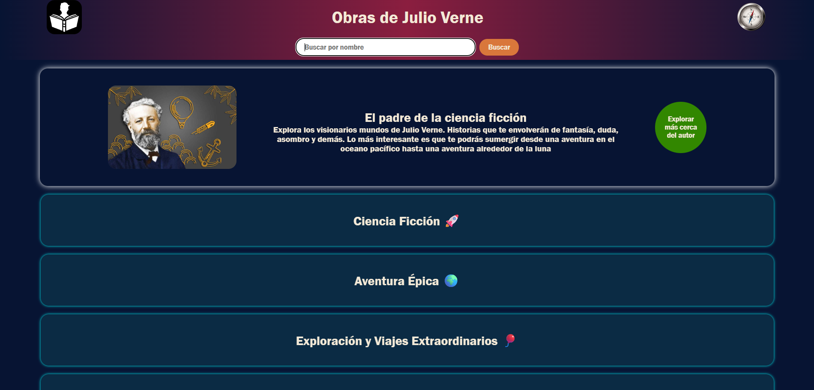
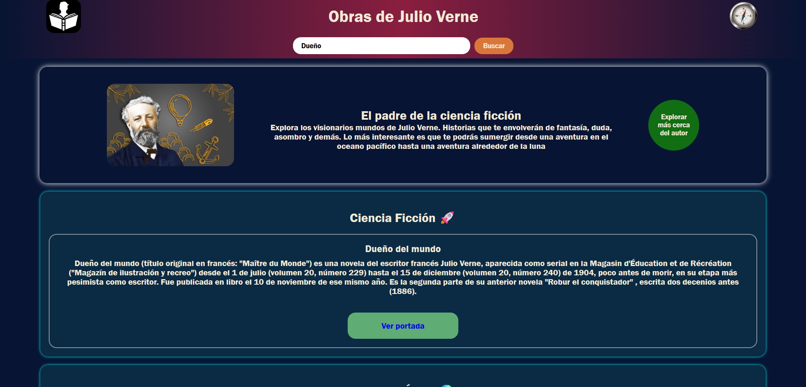
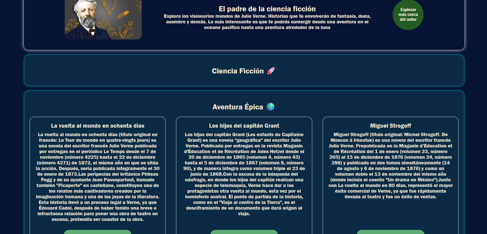

# JS - API
## _Nombre del taller_ 🚀

### ✅ Descripción del proyecto
Aplicacion de JS combinado con HTML5 Y CSS3 para consumir una API de WIKIPEDIA en la cual se obtendran los datos de los libros de JULIO VERNE, ademas de una pequeña descripcion antes de las opciones para mostrar, cuenta con el filtrado por nombre y además con un boton para profundizar más acerca del autor. Su vista principal esa enfocada en sus categorias

---
### 🔗 API usada
```bash
https://es.wikipedia.org/w/api.php
```
---

## Captura de pantalla 🖥️
Capturas de pantalla que muestran la aplicación en funcionamiento.
1. Captura de pantalla del programa en general
 

2. Captura de pantalla enfocado en la barra de busqueda


3. Captura de pantalla de su busqueda al dar click en las categorias
 

---

### Como ejecutarlo localmente 🔅
1. Clonar el repositorio:
```bash
https://github.com/Anderson-Oloroso/JS-API.git
```
2. Abrir la carpeta
3. Abrir con el navegador el archivo principal index.html
---

### Como verlo en internet 🌨️
Acceder al siguiente enlace:
```bash
https://anderson-oloroso.github.io/JS-API/
```
---
## 💻 *Tecnologías utilizadas*
- HTML5
- CSS3
- JS

---

## 👤 _Creador_
#### *Nombre:* <u>Henrik Anderson Oloroso García</u>
##### *Ultima modificación:* <u>10 de mayo del 2026</u> 
---